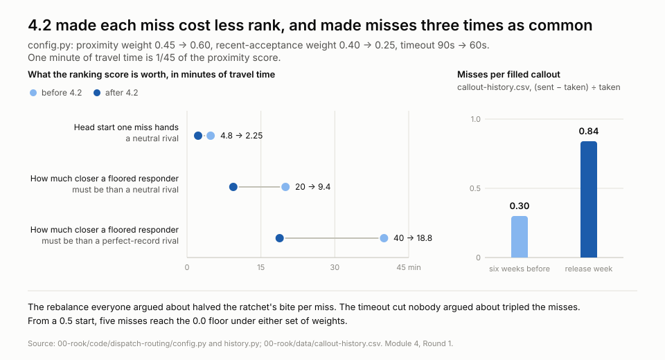
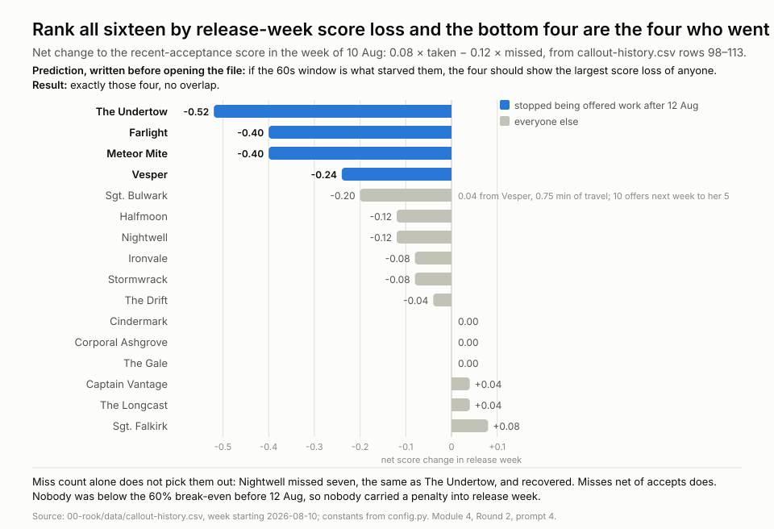
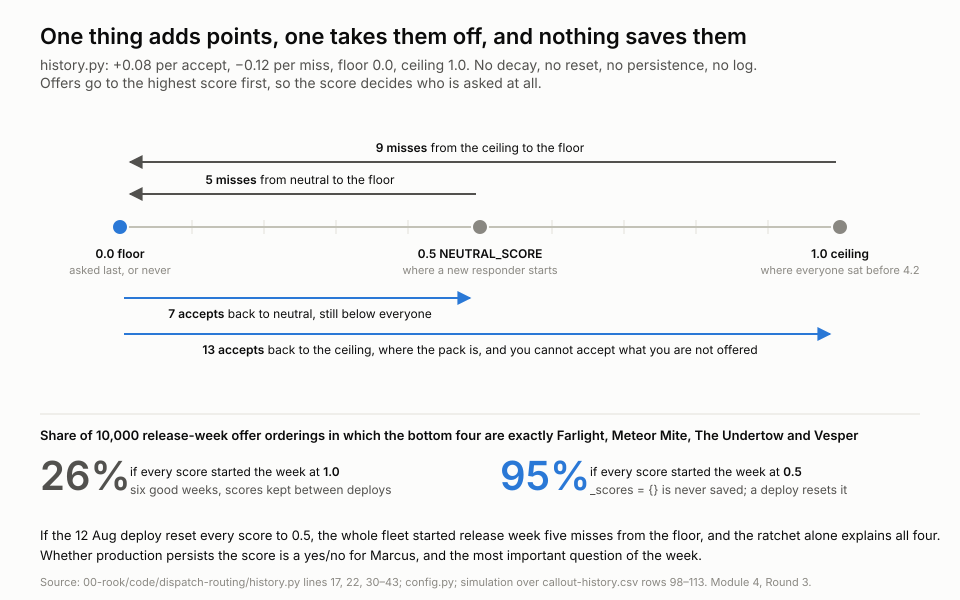

# 04 · X-Ray Vision — prompts

**Context:** You joined Rook two weeks ago as PM on Dispatch.
Release 4.2 shipped on 12 August, just before you arrived, and
landed badly. Last session the numbers showed you what happened: a
ping used to wait ninety seconds and now it waits sixty, people
missed pings they used to catch, and missing one counts the same as
turning one down — so four responders stopped hearing from us
altogether.

At the end of the session, ask Claude Code to save the prompts you
wrote yourself below — not the starter prompt. The closing slide has
the exact prompt to paste. By Module 6 this file is a prompt library
built from your own questions.

---

## Round 1 — what the code says changed, and what it didn't

_Goal: I have a working map of five files. Something in them changed enough to leave four responders getting no pings. Ask three things that would find out what changed and why it matters to a responder, using the numbers in `config.py` rather than the changelog's summary._

### 1.

Using the values in `config.py` and the score rules in `history.py`, show a responder who starts at 0.5 and misses offers because of the 60s window. After each miss, work out how many minutes closer a rival with a neutral score needs to be to outrank them, under the old weights (0.45 / 0.40) and the new ones (0.60 / 0.25) side by side. Find the point where the responder can no longer be first in line for any callout in their region, and count how many misses it took to get there. Then explain why, once they're there, the code gives them no way back.

_Why this one: Round 2 (Module 2) established the ratchet exists but never priced it. "Some responders get no pings" is a theory until it's a number — how many misses to fall below the fold, and whether 4.2 made that number smaller._

### 2.

`routing.py` says nobody is ever removed from the list. So walk through every path by which a responder who is marked available could go a full week without an offer reaching their phone: ranked too low every time; offer pushed but never displayed (`push_to_device` is a stub, and 4.1 touched "mobile push reliability"); offer withdrawn before the phone rendered it; availability record not saying what the responder thinks it says. For each path, name the file, say whether 4.2 made it more or less likely, and say what single piece of data from Ravi would confirm or rule it out.

_Why this one: "phone never goes off" currently has one explanation (ranking) and the code offers at least three others. Enumerating them before asking Ravi for data stops us anchoring on the ratchet if it's actually something else._

### 3.

`config.py` says anyone more than 45 minutes away scores zero on proximity. Work out the maximum possible total score for such a responder before and after 4.2, and how close a rival needs to be, at neutral acceptance and no matching skills, to beat them. Then assess whether the 4.2 rebalance, which was meant to help wide-geography responders, could have made things worse for the ones furthest out, and draft the question to ask Wen about whether the horizon was ever revisited when the weights moved.

_Why this one: the proximity weight went up but the 45-minute cliff didn't move. That's a possible second, distinct population of silent phones, and it's the one the 4.2 change was sold as helping._

### What this round found

- **Only three numbers changed in 4.2, all in `config.py`. No logic changed.** Timeout 90s→60s; proximity weight 0.45→0.60; recent-acceptance weight 0.40→0.25. The +0.08/−0.12 points, the 0.0 floor, the 45-minute horizon and timeout-equals-decline are all untouched.
- **4.2 made each miss cost *less* rank, not more.** Under the old weights a miss cost 4.8 minutes of distance advantage against a neutral rival; now 2.25. A floored responder had to be 20 minutes closer than a neutral rival to be asked first; now 9.4 (against a perfect-record rival: 40 → 18.8). This corrects Module 2's "the ratchet is the whole story": the ratchet is unchanged and bites less per miss. What 4.2 changed is **how often it bites**. The 60s window turned occasional misses into a release-week cohort miss rate of 54%, under the 60% break-even, and from a 0.5 start five misses reach the floor regardless of weights (nine from the 1.0 ceiling).
- **The code can't give a miss count for "silenced."** Whether 9.4 minutes buries you depends on how far apart responders are. Dense region: someone is always closer, floored means permanently below the fold. Sparse region: a floored responder may still be first sometimes. Testable prediction: the four starved responders are in dense regions or far from incident clusters. If Ravi shows any of them as the only responder for miles, the ratchet didn't silence them.
- **From the floor, recovery needs 7 accepts (0.5 / 0.08) and a floored responder in a dense region gets zero offers to accept.** Only a manual reset works. Wen's 2019 TODO in `history.py` about decay is still the only acknowledgement of this.
- **A second, score-free path to a widening spread.** Cutting the record's weight from 40% to 25% removed protection from *reliable* far responders too. A perfect record used to be worth 40 minutes of distance; now 18.8. Offers concentrate on whoever is nearest regardless of history, so the same few near responders top every list. The 6x→21x offer-spread widening from Module 2 could be this as much as the ratchet. One cut separates them: are the starved four low-score, or just far from incident hotspots?
- **Eight paths to a silent phone, of which four are "the list never reaches you."** (a) floored score; (b) far from incidents, record irrelevant; (c) callout filled before the list reaches them, since `offer.py` stops at first accept; (d) past the 45-min horizon; (e) offer withdrawn before the phone rendered it, more likely at 60s; (f) push never delivered, already ruled out in Module 2; (g) availability record wrong, possibly touched by the filter-persistence bug since handlers set availability from the console; (h) wrong region. a–d are indistinguishable from a ticket. The single most useful datum is **rank position per callout per responder**: it splits a–d from e–h in one pull. Ask Marcus whether the 4.0 "routing override audit log" records rank positions or only manual overrides.
- **The horizon cap got strictly worse.** A responder past 45 minutes tops out at 0.40 (was 0.55). A rival with **none of the needed skills** and a neutral record now beats a fully-qualified, perfect-record responder at 46 minutes if the rival is within 24.4 minutes (was 10). A qualified neutral rival beats them from 35.6 minutes (was 25). The unqualified near responder is asked first, can't do the job, declines or times out (−0.12 for them, 60s burned), and only then does the offer move on. Skills at 15% is the weakest input; "can do it at all" doesn't gate anything.
- **4.1 and 4.2 stack.** 4.1 switched proximity from straight-line distance to travel-time estimate; on rural roads that runs longer, so more responders crossed the 45-minute line in June. 4.2 then raised the price of being past it. The "wide-geography fix" helps responders inside the horizon and punishes the ones outside it, and 4.1 moved people from the first group to the second.
- **Question for Wen, drafted:** when the weights moved in 4.2, was `PROXIMITY_HORIZON_MINUTES` revisited? Was 45 set against straight-line distance originally? Is there a reason skills are a 15% weight rather than a gate?

### The hypothesis

**The reason some responders are getting no pings at all is that the 4.2 timeout cut pushed them to the floor of a recent-acceptance score that has no way back up, in regions where someone is always a few minutes closer**, because the score only moves when you answer an offer, the 0.0 floor is absorbing, and under the new weights a floored responder needs to be 9.4 minutes nearer the incident than a neutral rival to be asked first, which in a region with any responder density never happens. The 60s window, not the weight rebalance, is what changed: it turned occasional misses into a cohort-wide miss rate under break-even, and the four who kept missing in the following days hit the floor and stayed there.

**Falsified if:** Ravi's data shows any of Farlight, Meteor Mite, The Undertow or Vesper with a score above ~0.1, or shows them as the nearest available responder to incidents they weren't offered. Then the answer is the horizon cap or proximity concentration, not the ratchet.

**Not claimed:** that this explains everyone who *feels* silent. Nightwell and Stormwrack were accepting callouts in the weeks they reported nothing; that's a different problem (possibly path e, or bad data) and this hypothesis doesn't cover them.

---

## Round 2 — check the hypothesis against last session's numbers, then push past it

_Goal: Marcus asked on 14 Aug whether the routing change applied to responders who'd already been turning jobs down, or just new ones. Nobody answered; Wen is out. Predict what `callout-history.csv` must show if the Lab A hypothesis is right, then check, and see whether the check answers Marcus on the way. Then take what the check left open (one untested clause, a diagnosis with no fix, a Module 3 safety flag nobody followed up) and push on each._

### 4.

My hypothesis is that the four starved responders fell to the floor of the recent-acceptance score because the 60s window made them miss offers in release week, and the absorbing floor kept them there. Before looking, write down what `callout-history.csv` must show if that's true: (1) the four were *not* below the 60% break-even before 12 Aug, so they carried no pre-existing penalty; (2) in release week they lost more score than anyone else, computed as 0.08 × taken − 0.12 × (sent − taken); (3) ranking all 16 by that release-week loss puts exactly those four at the bottom; (4) their offers fall *after* the score falls, not before. Then check each, and say where the numbers stop supporting it. Along the way: were any of the 16 "already turning jobs down" before 4.2, and did the code treat them differently?

_Why this one: the same predict-then-check move as Module 3. Writing the four predictions down before opening the file means the data can say no. And Marcus's question is prediction (1) in different words._

### What the check found

- **Prediction 1 holds, and it answers Marcus.** Pre-release acceptance for the four: Farlight 74%, Meteor Mite 69%, The Undertow 78%, Vesper 82%; fleet range 69–84%. Vesper had the second-best record of anyone. Nobody was below break-even. Since all 16 were above 60% for six straight weeks, every score was pinned at or near the 1.0 ceiling before 4.2 and effectively identical. **Pre-4.2 the history component was inert; proximity decided everything.** The "already declining" cohort Marcus pictured didn't exist.
- **Predictions 2 and 3 hold exactly.** Ranking all 16 by release-week net score change (0.08 × taken − 0.12 × missed): The Undertow −0.52, Farlight −0.40, Meteor Mite −0.40, Vesper −0.24, then Sgt. Bulwark −0.20, Halfmoon −0.12, Nightwell −0.12, everyone else −0.08 to +0.08. The bottom four by loss are the four starved responders, no overlap. Miss *count* alone doesn't pick them out (Nightwell missed 7, same as The Undertow, and recovered); misses net of accepts does.
- **Prediction 4 holds.** The four got 10–12 offers in release week, normal volume, and 3–5 the week after. Score fell first, offers fell second, as the code requires.
- **Where it stops: the boundary.** Vesper (−0.24) and Bulwark (−0.20) are 0.04 apart, which under 4.2 weights is 0.75 minutes of travel time. Bulwark got 10 offers in week 2 and took 8; Vesper got 5 and took 1. A 45-second edge can't produce a 2x offer gap on its own. The "in regions where someone is always a few minutes closer" clause of the hypothesis is doing real work, and the CSV has no location, region, or rank-position column to test it.
- **The code answer for Marcus:** the change applied to everyone identically. No cohort logic, no score reset or migration, nobody exempt. Anyone declining before 4.2 kept their existing score, and the rebalance made that history count *less* (0.40 → 0.25), not more.

### The one-sentence answer for Marcus

"Same rules for everyone, nobody was exempt or reset, and the four who went quiet weren't the ones turning jobs down before, they were among our most reliable, so the question isn't who it applied to but why a 60-second window made four good responders miss enough in one week to hit a floor there's no way back from."

### 5.

Vesper (−0.24) and Bulwark (−0.20) are 0.75 minutes apart in ranking terms, yet got 5 and 10 offers the next week. Two things could close that gap and the CSV can probe both. First, order: release-week scores depend on which offers came first and I only have weekly totals. Simulate the release week per offer under 10,000 random orderings of each responder's accepts and misses, clamping at each step, and report how often the bottom four is exactly {Undertow, Farlight, Meteor Mite, Vesper} and how often Bulwark or Halfmoon swaps in. Second, place: `handler` is the only location proxy in the file, and Kip's two responders share a city with one starved and one overwhelmed. For every handler with more than one responder, show whether offers moved *between* their responders after 12 Aug. If the starved four each have a handler-mate who gained what they lost, the "someone always closer" clause is doing the work and it's a within-region reshuffle, not a fleet-wide drop.

_Why this one: the hypothesis survives on one untested clause. This is the closest the file can get to testing it before Ravi._

### 6.

Take the observed sent/taken pattern as the demand and replay the recent-acceptance score for all 16 under one change at a time: (a) timeout back to 90s, modelling it as recovering the release-week miss rate to the pre-release 24%; (b) decay toward 0.5 at Wen's 2019 TODO, say 0.02 per day without an offer; (c) floor raised from 0.0 to 0.2; (d) timeout penalised at half a decline; (e) one-off manual reset to 0.5 on 1 Sep. For each: are the four still at the floor on 31 Aug, how many other responders change rank order, and what does it cost the twelve who are fine. Then say which one I'd put in front of Marcus as a 4.2.1 patch and which needs Wen.

_Why this one: the diagnosis is done. Marcus and Helen will ask "so what do we change," and each fix has a different blast radius. A replay turns five opinions into one table._

### 7.

The code says each callout produces exactly one `taken` if it was filled, and one `taken` plus k misses as it cascades. Weekly `taken` went 132 → 96, 104, 108, 120 while `sent` stayed flat. Under that model, how many callouts were filled each week, how many misses per filled callout, and how much responder-time was burned waiting (misses × 60s)? Then estimate the callouts that reached the bottom of the list unfilled, and check whether the 28% of offers the starved four used to absorb were re-routed to others (their `taken` should rise by roughly that) or simply lost. Say whether this is a coverage-gap number I can put in front of Helen, and what it would take to make it one.

_Why this one: Module 3 flagged "about 25 incidents a week found nobody" and nobody followed it up. It's the only finding in the investigation that is a safety matter rather than a fairness matter, and the code now gives a model to size it properly._

### What the push-past found

- **Three of the four are robust to offer order; Vesper is not.** Across 10,000 orderings, The Undertow is in the bottom four 100% of the time, Farlight 96%, Meteor Mite 93%, Vesper 31% (median rank 5th, not 4th). Nightwell 22%, Bulwark 15%. The exact starved four comes out in only 26% of orderings. The ratchet explains why Vesper couldn't recover once she got 5 offers and missed 4 in week 2; it doesn't explain why she got 5 rather than Bulwark's 10. A second factor put her there.
- **The one geographic data point supports the reshuffle.** Kip is the only handler with two responders: Meteor Mite 11.2 → 2.3 offers/week (−79%), The Gale 13.0 → 19.3 (+49%), same city. The Gale absorbed most of what Meteor Mite lost. The other 14 handlers have one responder each, so the file can go no further on place.
- **The trickle reinforces the floor.** In weeks 3–4 the four still received 0–2 offers each and took none. An offer that reaches rank 15 has been open 14+ minutes and been passed over by everyone; those are the stale ones. Each miss is another −0.12.
- **All twelve others are at the 1.0 ceiling, so the score's effective range is "at the ceiling, or falling."** Any fix that doesn't return the four to 1.0 leaves them below every other responder on an equal-distance callout: reset to 0.5 is still a 9.4-minute handicap, floor 0.2 is 15 minutes, decay at 0.02/day is too slow against −0.12 per miss (0.07–0.23 by 31 Aug). Halving the timeout penalty gets them to 0.66–0.72, still under everyone. The ceiling also wastes credit: six weeks of a perfect record buys no more buffer than one, because accepts at 1.0 do nothing. Four straight misses from the ceiling gets anyone to 0.52.
- **The 90s row is circular.** Modelling "timeout back to 90s" as restoring the 76% accept rate un-starves all four, but that assumes the timeout caused the misses, which is the hypothesis. It says "remove the cause and the effect goes," not that 90s is proven.
- **For Marcus as a 4.2.1 patch (config and ops, no logic):** timeout back to 90s, and a one-off reset of the four to **1.0, not 0.5.** **For Wen:** whether the score should have a ceiling at all, decay, and treating a timeout as less than a decline. Halving the timeout penalty is the only structural change that keeps the four in contention on its own, and it needs her.
- **If `taken` counts filled callouts, ~100 fewer were filled in the four weeks after 12 Aug than the pre-release run rate** (36, 28, 24, 12 short per week) while offers sent stayed flat (177, 158, 162, 165 vs 172). The alternative reading is that incidents fell 27% in the exact week 4.2 shipped. "August is soft" needs that, but the two August weeks before release (132, 134 taken) show no softening. Neither reading can be proven from this file. **One number from Ravi settles it: callouts created per week.** It's a safety question, not a fairness one.
- **The other twelve absorbed 25 of the 37 offers per week the four used to take, and are still 12 short by 31 Aug.** The fleet re-routed most of the load, not all of it.
- **Time-to-accept, the metric the timeout cut was meant to improve, is better than pre-release in the latest week only:** 22s of miss-waiting per fill (0.38 misses × 60s) vs 27s before (0.30 × 90s). Pooled over all four post-release weeks it is 33s, worse than before (51s, 31s, 30s, 22s week by week). The last week got there by making each miss cheaper and by removing the four slowest responders from the list. If anyone cites time-to-accept as evidence 4.2 worked, this is why.
- **To make the coverage number a claim for Helen:** callouts-created per week from Ravi, and confirmation that `pings_taken` means "accepted" rather than "attended." With those, "about 100 incidents" is a number; without them it's a question.

### The insight

**Pre-4.2 the acceptance score didn't rank anyone, because everyone was pinned at the ceiling; 4.2's timeout cut is what made scores diverge for the first time, and a ratchet that had been dormant since 2019 switched on.** The weight rebalance, the change everyone argued about, halved the ratchet's bite per miss. The timeout, the change nobody argued about, tripled the misses. Three of the four starved responders are fully explained by that alone; the fourth needed a rival a few minutes closer, and the one place the file can see it (Kip's two responders) shows exactly that.

Two things follow. First, the fix is not "revert the routing change": it's the timeout, plus a reset to 1.0 for the four, plus a conversation with Wen about a score whose only two stable states are the ceiling and the floor. Second, the fleet-wide numbers are hiding the cost: time-to-accept improved *because* the four dropped out of the denominator, and ~100 callouts may have gone unfilled while it did. That's the number to chase before the regroup, and it's one column from Ravi.

---

## Round 3 — points off, points on

_Goal: the code keeps score with points; more points, closer to the front of the line. Find what takes points off, then everything that puts them back. Then keep asking what's missing, not just what's there._

### 8.

Find me the part of this code that takes points off somebody when they miss a ping or turn one down. Show it to me and explain it in plain English. Then find me every single thing in this code that puts points back on.

_(Starter prompt, as given.)_

### What the starter prompt found

- **Points off:** `record_declined` in `history.py`, −0.12, called from `offer.py` after every offer that didn't come back accepted. The docstring says it in so many words: a tap-to-decline and a 60s timeout are "same either way — we asked and we didn't get a yes."
- **Points on: exactly one thing.** `record_accepted`, +0.08, called only when the answer was accepted. Nothing else writes to the score. No drift back to the middle (Wen's 2019 TODO), no reset, no credit for being available, on shift, skilled or nearby, and no way to earn a point without first being offered something.
- **That last one is the trap.** Offers go to the highest scores first, so once someone nearby always outranks you, you never get the offer you'd need to climb.

### 9.

`record_declined` is called with one argument: the responder. Look at everything `offer.py` knows at that moment and doesn't pass along: whether the answer was a tap-to-decline or a timeout, whether the phone ever acknowledged the push, how long the callout had already been open when it reached this person, what position in the list they were, how far away they were. For each, say what the score *could* do differently if it had it, and what a handler could be shown. Then tell me what the code would need to record to make "phone never went off" and "saw it, said no" distinguishable after the fact, since right now no log can separate them.

_Why this one: the penalty is blind by design, and the comment says so. The missing information is what a fix, and the investigation, both need._

### 10.

`_scores = {}` in `history.py` is a plain in-memory dictionary. Find every place it's saved, loaded, backed up, or migrated. If there are none, walk through what happens to every responder's score when the service restarts, including the 12 Aug 4.2 deploy: does everyone go back to 0.5? If so, redo the release-week arithmetic from 0.5 instead of 1.0 and tell me how many misses it takes to hit the floor from there, and whether that changes which responders the code predicts would starve. Then say what else in the system might reset it (a new app version, a re-registered device, a handler reassignment) and whether any of those happened to the four.

_Why this one: I'd been assuming scores were at the ceiling going into 4.2 because of six good weeks. If the deploy wiped them, everyone started release week four misses from the floor, and the collapse needed much less to happen._

### 11.

Find every place in this code where an outcome is silent: no log, no event, no notification. Start with `dispatch()` returning `None` when the list runs out, `withdraw_from_device` after a timeout, and a responder being ranked below the fold on a callout they never see. For each, say who *should* have known (the handler, the responder, Nadia's queue, Ravi's report, the console) and confirm that nothing in this folder tells them. Then say which single missing event, if it existed, would have surfaced the starved four in the first week instead of the fourth, and which one would tell Helen whether ~100 callouts went unfilled.

_Why this one: Module 2 found "starvation generates no event, so it never generates a ticket." This is the code-level version of that: an inventory of the silences, and which one is a safety gap rather than a fairness one._

### What the push-past found

- **The penalty discards six things `offer.py` already knows:** decline vs timeout (the two constants exist at `offer.py:15-16` and are collapsed at the call site), whether the phone acked the push (never collected), how long the callout had been open, list position, travel time (computed for ranking, then dropped), and the callout itself. The score is the only record of what happened, and it's one number that has forgotten how it got there. **Minimum to separate "never went off" from "said no":** one line per offer with responder, callout, list position, push-sent time, device-ack time or none, answer, answer time. Nothing in the folder writes it.
- **The score is never saved.** `_scores` is written at `history.py:43`, read at `history.py:22`, and nothing persists, loads, or migrates it. As written, every responder is 0.5 the moment the process starts. If production behaves like this file, the 12 Aug deploy put all 16 at 0.5, not the 1.0 ceiling their six good weeks implied. From 0.5 the floor is **5 misses away**, not 9.
- **From 0.5, the ratchet alone picks out all four.** Rerunning release week across 10,000 offer orderings: the bottom four is exactly the starved four in **95%** of orderings (was 26% from 1.0); Vesper is in it 96% (was 31%); median end-of-week scores for the four are 0.00–0.26 (was 0.48–0.68); The Undertow touches the floor in 100% of orderings. **This closes the Vesper gap from Round 2 without geography.** The "someone always closer" clause becomes unnecessary rather than untested. And the release-week fleet collapse to 54% wasn't sixteen people falling from a comfortable ceiling; it was sixteen people who all started four misses from the floor on the day the window shrank.
- **Caveat, and it's the whole question:** stubs in this folder are marked `...`; `_scores` isn't. Whether the real service persists scores across deploys is a yes/no for Marcus, and it's the most important question of the week. No interview, ticket, or Slack message mentions a reinstall, re-registration, or reassignment for any of the four; I searched all of them.
- **Seven silences, none logged.** List runs out (`offer.py:31` returns `None`, nobody told, no retry, no escalation); offer withdrawn after timeout (responder has no evidence it existed); ranked below the fold (not an event; the list is computed and discarded); score changes (never surfaced; nobody at Rook can look one up); score hits the floor (a `max()` call, looks like any other write); callout took k misses to fill (`dispatch()` returns the responder, not the count); unqualified responder asked first and declines (indistinguishable from any other decline). There is no `log`, `emit`, `notify`, or `audit` call anywhere in the folder; the 4.0 "routing override audit log" isn't in this code.
- **The event that would have surfaced the four in week 1:** score crossed below a threshold, sent to the handler. All four crossed 0.2 in release week under the 0.5-start model. Nadia would have had four alerts by 16 Aug.
- **The event that would tell Helen about the ~100 callouts:** `dispatch()` returned `None`, counted per week. One line at `offer.py:31`. The only silence that's a safety matter rather than a fairness one, and the cheapest to add.

### Say it plainly

For someone who's gone quiet, they would need to **be offered a callout and accept it, about thirteen times in a row without a single miss, while getting no offers at all**, because accepting is the only thing in the code that adds points, offers only go to people with more points than them, and nothing else, not time passing, not being available, not a handler asking, not a deploy, puts a single point back. In practice that means someone at Rook resetting their score by hand. There is no code for that either.

### The insight

**Asking what's missing found more than asking what's there.** What's there is one penalty and one credit, and Module 2 already had that. What's missing is a save (so a deploy may have reset everyone to the midpoint and put the whole fleet four misses from the floor), a record of *why* a point came off (so "never went off" and "said no" are the same number forever), and any event at all when something goes wrong (so a callout nobody took and a responder nobody asks look identical to a normal Tuesday).

The hypothesis gets simpler, not more complicated: if the deploy reset the scores, the 60s window plus the ratchet explains all four with nothing else needed, and Vesper stops being an exception. Three asks, all yes/no: **Marcus**, does the score survive a deploy; **Ravi**, callouts created per week; **Wen**, why the score has no floor alert, no decay, and no memory of how it got where it is.
