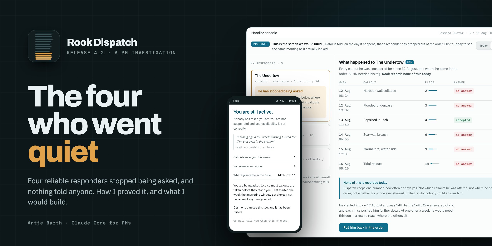

[](https://antje.github.io/product-school-claude-code-for-pms/final-report.html)

# The four who went quiet

Release 4.2 of Rook Dispatch pushed four reliable responders to the bottom of a ranking they cannot climb out of. Total offers barely moved. They went to fewer people, and nothing in the product noticed, recorded it, or told anyone.

**[Open the final report](https://antje.github.io/product-school-claude-code-for-pms/final-report.html)** · [Click through the prototype](https://antje.github.io/product-school-claude-code-for-pms/05-super-speed/prototype.html) · [Read the brief for Helen](05-super-speed/brief.md)

My work for Product School's Claude Code for PMs certification, by Antje Barth. Rook Industries is a fictional teaching scenario: nothing about it is a fact about the world.

## What 4.2 did

| | | Source |
|---|---|---|
| **4 of 16** | responders stopped being asked: Farlight, Meteor Mite, The Undertow and Vesper | `00-rook/data/callout-history.csv` |
| **79–89%** | fewer offers each in the three weeks after release, 62% on the most cautious slicing | `03-rewind/prompts.md` |
| **54% → 73%** | the headline acceptance rate, which dipped in release week and looked like it recovered | `callout-history.csv` |
| **28% → under 2%** | the four's share of all offers over the same weeks; part of that recovery was them no longer being counted | `callout-history.csv` |
| **0** | log calls anywhere in the routing code | `00-rook/code/dispatch-routing/` |

## What I would do

1. **This week:** put the four back at the top of the range, recorded with a name and a reason. The midpoint sounds fair and is not, because everyone else is at the top.
2. **First build:** record every offer, who it went to, where they were in the order, and what came back. Turn the timer back to 90 seconds in the same release, said openly.
3. **Then:** alert the handler the day a responder drops below the threshold, and tell the responder where he stands.
4. **Next:** let the score ease back over time, the question Wen left in the code in 2019.

Not reverting the ranking weights, not resetting anyone silently, and not a setting somebody flips.

## How I found it

| Module | Technique | What it found | The work |
|---|---|---|---|
| 1 · Onboard | A context file written from Rook's own documents | The ranking change alone was too small to explain the collapse (modelled) | [`CLAUDE.md`](CLAUDE.md), [`01-origin-story`](01-origin-story/prompts.md) |
| 2 · Listen | Group, count and quote; then ask what nobody said | None of the handlers interviewed uses the phone the offers arrive on | [`02-super-hearing`](02-super-hearing/prompts.md) |
| 3 · Verify | The rows behind the number, then a second method | The same four names under 27 ways of measuring | [`03-rewind`](03-rewind/prompts.md) |
| 4 · Inspect | Write down what the data must show, then check | A score with no way back up; all four predictions held | [`04-x-ray-vision`](04-x-ray-vision/prompts.md) |
| 5 · Prototype | A brief for one real person, then something to click | His month took 19 days and two tickets; with this built, one alert on the day | [`05-super-speed`](05-super-speed/) |
| 6 · Automate | A skill written once, run, and scheduled | It flagged a guess written as a fact in my own brief | [`06-sidekicks`](06-sidekicks/prompts.md), [`review-checklist`](.claude/skills/review-checklist/SKILL.md) |

Every `prompts.md` holds the prompts I wrote in that session. Where a later module corrected an earlier one, the earlier file carries a dated note rather than a quiet edit.

## What would change the plan

- **If Ravi's count of callouts created shows about a hundred went unanswered**, this stops being a fairness fix and becomes a safety issue.
- **If Wen says the score survives a deploy**, the alert can ship before the offer record.
- **If specialists turn out to be losing callouts to people without the needed skill**, capability becomes a gate on the list.

## Repo map

```
final-report.html            the presentation, start here
CLAUDE.md                    working context, with what each session added
4.2-investigation.md         the findings log
4.2-regroup-brief.md         the brief for the regroup with Helen, Marcus, Wen and Nadia
00-rook/                     Rook's own documents, data, feedback and code, read-only
01-origin-story/             Module 1 prompts, with two dated corrections
02-super-hearing/            Module 2 prompts, four rounds, each with what it found
03-rewind/                   Module 3 prompts, confidence-graded, the number for Helen
04-x-ray-vision/             Module 4 prompts, the answer for Marcus, one chart per round
05-super-speed/              the brief for Helen, the clickable prototype, and the prompts
06-sidekicks/                the skill's runs, a brief written to fail, the documented schedule
.claude/skills/              review-checklist, the skill itself
```

The session-scope block at the top of `CLAUDE.md` stays in place, so Claude never treats Rook as a real company.
